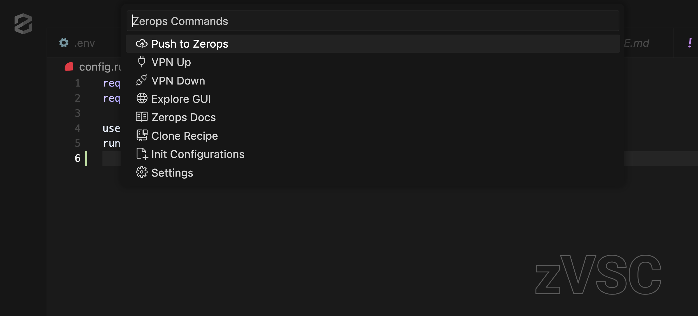

  

  <b>zVSC: Zerops VS Code Extension for Interacting with Zerops</b>

  

  
  

<!-- ## Features -->

## Installation

Install from VS Code or Windsurf Extensions marketplace (Ctrl+Shift+X) by searching for "zvsc".

### Prerequisites

- [Zerops CLI (zcli)](https://docs.zerops.io/references/zcli) - Required for all operations
- [WireGuard](https://www.wireguard.com/install/) - Required for VPN connectivity

## Authentication

### Personal Access Token
Generate a token at [Settings > Access Token Management](https://app.zerops.io/settings/access-token-management) with a descriptive name. Copy it immediately as it's shown only once.

## Support and Resources

- [📚 Documentation](https://docs.zerops.io)
- [💬 Discord Community](https://discord.gg/zeropsio)
- [🐞 GitHub Issues](https://github.com/zeropsio/zvsc/issues)
- [✉️ Email Support](mailto:support@zerops.io)

## License

This extension is licensed under the MIT License. See the [LICENSE](LICENSE) file for details.
